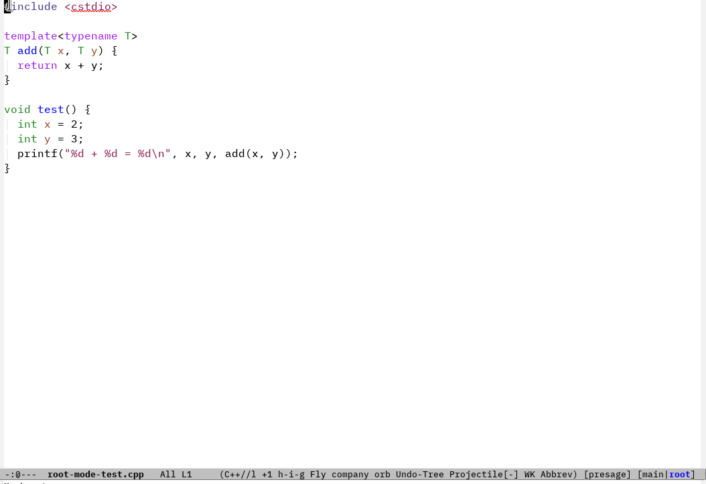

# ROOT-mode

ROOT-mode is an Emacs major-mode for interacting with ROOT
(https://root.cern/). Specifically, this package provides the
facilities to run the ROOT command line interface/REPL.



## Installation & Configuration

The package is not on MELPA, so you can either clone the repository
and manually load the file in Emacs, or use something like
use-package/straight. Here is one example of installing/configuring
the package with straight.el:

```lisp
(use-package root-mode
  :bind (:map c++-mode-map
	     (("C-c C-c" . root-eval-defun)
	      ("C-c C-b" . root-eval-buffer)
	      ("C-c C-l" . root-eval-file)
	      ("C-c C-r" . root-eval-region)))
  :straight (root-mode :type git :host github :repo "jaypmorgan/root-mode")
  :config
  (setq root-filepath "/path/to/root"))
```

There are only a few variables provided by the package:

- **root-filepath** -- (string, default `"root"`) this is the
  absolute/relative path to the root executable. This could be left as
  the default "root" value if ROOT is available on your $PATH.
- **root-command-option** -- (string, default `""`) these are the
  command line options used when starting ROOT. By default there are
  no options.
- **root-prompt-regex** -- (string, default `"^\\[[0-9;^k]+m?"`) this
  is the regular expression used to find the input prompt of the ROOT
  REPL. If there is a customised prompt, this will need to be updated
  to suit the customisation.
- **root-buffer-name** -- (string, default `"*ROOT*"`) what to call
  the ROOT repl buffer when it starts. This could be left as the
  default `*ROOT*`, but its there for you to modify as you please.
- **root-terminal-backend** -- (symbol, default `'terminal`) the
  terminal emulator to run the ROOT instance in. There are only two
  current defined [`vterm`, `inferior`]. By default, the terminal
  backend is set to `inferior`. Though, there is still some issues in
  getting the auto-complete to work correctly. If you really need
  auto-complete, I would recommend switching the backend to `'vterm`
  (requires you've already installed vterm).
  
## Using the package

Below is listed the various commands provided by the package.

| Command                         | Description                                                                                                        |
|:--------------------------------|:-------------------------------------------------------------------------------------------------------------------|
| `run-root`                      | Start the ROOT REPL in the same window.                                                                            |
| `run-root-other-window`         | Start the ROOT REPL in a different window.                                                                        |
| `root-switch-to-repl`           | Move the cursor to the ROOT REPL.                                                                                  |
| `root-eval-region`              | Evaluate a marked region in ROOT.                                                                                  |
| `root-eval-line`                | Evaluate this line in the REPL.                                                                                    |
| `root-eval-defun`               | Evaluate the current function in ROOT (current as defined by cursor position).                                     |
| `root-eval-defun-maybe`         | If the cursor is within a function declaration, then evaluate this function, else we'll evaluate this single line. |
| `root-eval-buffer`              | Evaluate the current buffer in ROOT.                                                                               |
| `root-eval-file`                | Evaluate a file (using the '.L' syntax), prompt for a file.                                                        |
| `root-change-working-directory` | Change the working directory of the root session, prompt for a directory.                                          |
| `root-list-input-history`       | List the previously input statements and for selection.                                                            |


## Running tests

To test the functionality of the package, some unit tests have been
stored in the `tests/` directory. To run these unit tests, you can
either evaluate the specific buffer in Emacs and run `ert` (see
<https://www.gnu.org/software/emacs/manual/html_node/ert/Running-Tests-Interactively.html>
for more information), or you can them all from the command line
using:

```bash
emacs -batch \
	-l ert \
	-l root.el \
	-l tests/test-root.el \
	-f ert-run-tests-batch-and-exit
```

## Comparison with other tools

- **inferior-cling**: https://github.com/brianqq/inferior-cling. This
  package hasn't been updated in quite a while, and is light on
  functionality.  ROOT-mode attempts to go beyond this to make the
  process of interacting with the REPL more seamless.  There are also
  other ongoing issues such as duplicated input
  (https://root-forum.cern.ch/t/interactive-input-in-emacs-is-echoed-progressively/24113)
  in dumb terminals (https://github.com/root-project/cling/pull/99)
  which have yet to be merged in cling. ROOT-mode solves these
  problems while we're waiting for the pull-request to be
  accepted. ROOT-mode also aims to support org-babel to allow one to
  execute C++ source code blocks from within an org-mode document.
